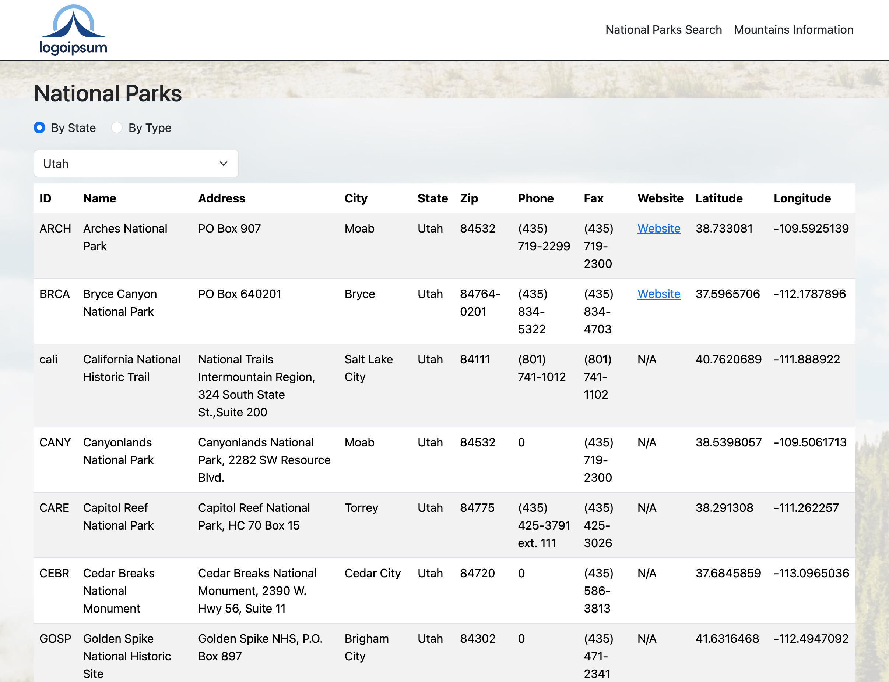
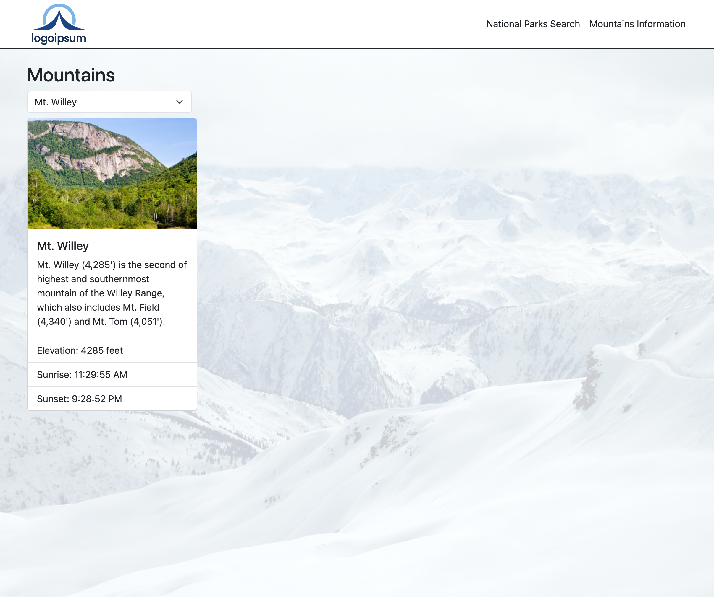

# National Parks Explorer

Welcome to **National Parks Explorer**! This project was created to help users discover information about various national parks and mountain ranges. Users can explore data such as park locations, types, and information about mountains, including elevation and sunrise/sunset times.

## Table of Contents

- [Features](#features)
- [Technologies Used](#technologies-used)
- [Usage](#usage)

## Features

- **National Parks Search**: View national parks by state or type.
- **Mountain Information**: Access detailed information about various mountains, including elevation and location.
- **Sunrise/Sunset Times**: Fetches real-time sunrise and sunset information for selected mountains using the Sunrise-Sunset API.

## Technologies Used

- HTML
- CSS (with Bootstrap for styling)
- JavaScript (ES6+)
- API Integration (Sunrise-Sunset API for real-time data)

## Usage

- **Homepage**: Brief introduction to the National Parks Explorer.

  - 

- **National Parks Search**: Users can filter parks by state or type and view details such as address, phone, and fax.

  - 

- **Mountains Information**: Select a mountain to view elevation, and fetch sunrise/sunset information based on location.
  - 
